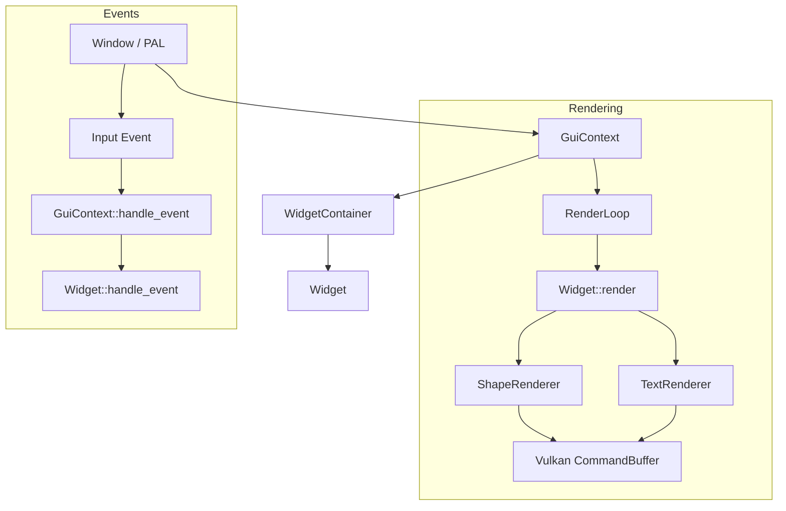

# GUI Framework

A retained-mode UI framework powered by Vulkan, designed for high-performance audio plugins.

## Core Concepts

### Widget Trait
All UI elements implement the `Widget` trait:
- `handle_event`: Process input (Mouse, Keyboard, Focus). Returns `EventResult`.
- `render`: Draw to `ShapeRenderer` (geometry) and `TextRenderer` (text).
- `bounds`: Screen space layout.

### Architecture
- **Retained Mode:** Widgets maintain their state (value, focus, hover).
- **Layout:** Flexbox-like layout engine (`Row`, `Column`, `Stack`) manages widget positioning.
- **Rendering:** Direct Vulkan draw calls via unified renderers. No intermediate scenegraphs (immediate-style drawing in a retained object).

### Theming
A consistent visual system defined in `theme.rs`:
- standardized color palette (Backgrounds, Accents, Text)
- Focus indicators (Glow/Outline)
- Hover/Pressed feedback

## Widgets

| Widget | Description |
|--------|-------------|
| **Button** | Standard clickable button with Label. |
| **Slider** | Horizontal or Vertical continuous value control [0.0, 1.0]. |
| **Knob** | Rotary continuous value control [0.0, 1.0]. |
| **Textbox** | Single-line text input with cursor navigation and selection. |
| **Container** | Layout container supporting padding, margin, and flex direction. |

## Usage

Widgets are managed by `WidgetContainer` in `GuiContext`.

```rust
// Creating a UI with layout
let mut container = Container::new(0.0, 0.0, 800.0, 600.0);
container.set_layout_direction(LayoutDirection::Column);

let button = Box::new(Button::new("Click Me", 0.0, 0.0, 100.0, 30.0));
container.add_child(button);
```

## Architecture Diagram


